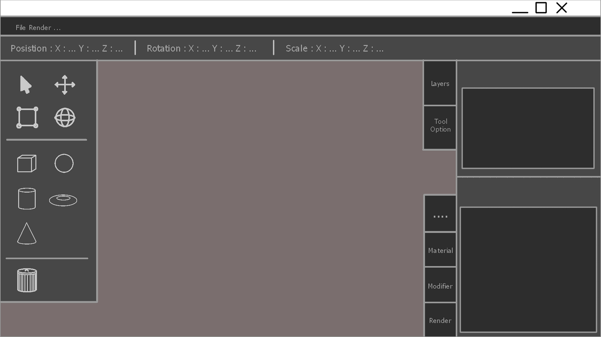
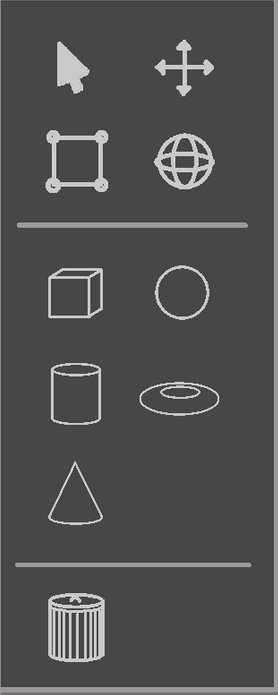
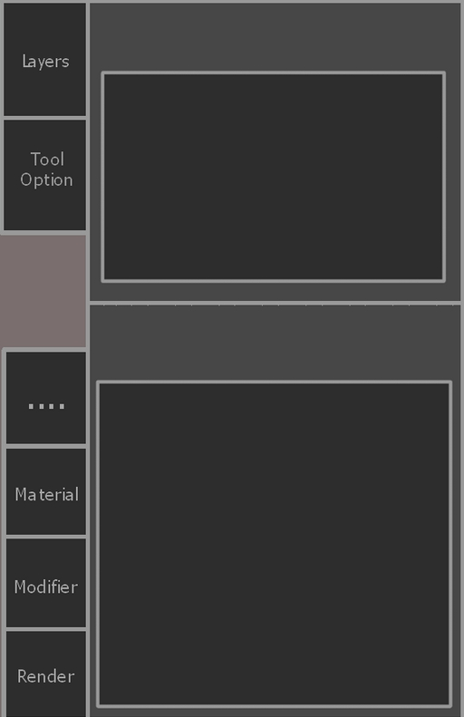
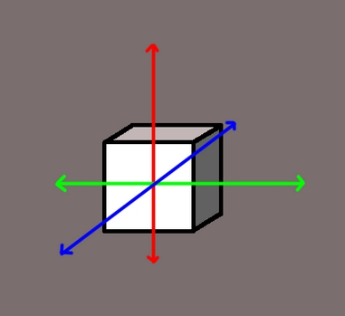
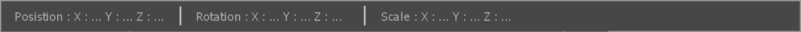
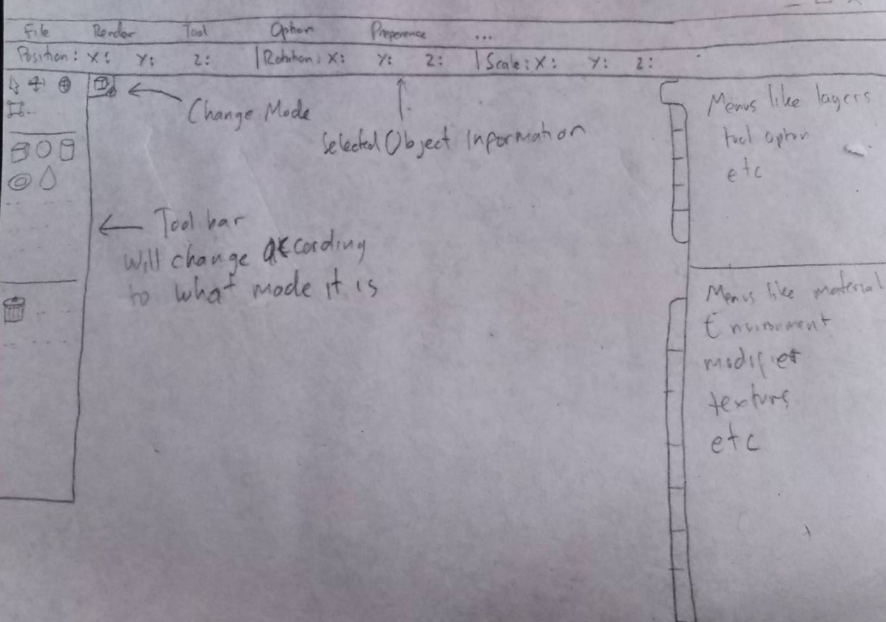

# Usability Evaluation and Prototyping (again)
> Usability Evaluation in this assignment is to evaluate your high-fidelity interactive-prototype with two participants:
> the participant from the previous Contextual Inquiry (CI) 
> and an additional novice-participant with different demographics if possible.
> Respectively, revise your prototype as an attempt to fix any problems found in this Usability Evaluation.

## Operating the Prototype
[Link for video of me operating the prototype](https://youtu.be/sfEzPfq6dJQ)

## Part A: Usability Evaluation
### 1. Brief Description of Participants
#### a. Description of Participant 1
 - She is a female
 - Studying at Unair Public Health Department
 - She is 22 years old
 - Never done any 3d modelling

#### b. Description of Participant 2
- He is a male
- He is 19 years old
- Have experience in 3d modelling

### 2. Evaluation Script
> 1. Create a cube
> 2. Move the cube
> 3. Delete the cube
> 4. Create a tube
> 5. Rotate the tube
> 6. Open the layer menu

### 3. Transcript
#### a. Transcript with Participant 1
1. **(00:00) Me:** Dadi kan sampeyan wes tau nggawe aplikasi asline kan? nah iki aku nggawe dewe.
1. **(00:10) Part:** Dadi awakmu wes nggawe aplikasi.
1. **(00:13) Me:** Ndak, iki mek prototype tok, saiki coba buat kubus.
1. **(00:23) Part:** Kubus iku opo? iki kan? (clicking acub button)
1. **(00:30) Me**: Coba gerakno kubuse nang kanan
1. **(00:35) Part:** (clicking right arrow on keyboard) loh kok ngene?
1. **(00:43) Me:** Bukan-bukan, ini prototype tok dadi gk ono interaksi nggawe keyboard sik an.
1. **(01:01) Part:** (after roaming the mouse aroung the screen) Oh iki iki, (then click the move tool, then she click the gizmoz to the direction right)
1. **(01:10) Me:** Saiki hapus kubus e.
1. **(01:13) Part:** Oh iki iki (clicking the trash can)
1. **(01:21) Me:** Saiki nggawe kubus
1. **(01:24) Part:** (clicking the tube button) Oke iki
1. **(01:34) Me:** Saiki puter kubus e
1. **(01:37) Part:** (clicking move button) Kok gk muncul? Tadi kok bisa aku mencet tombol itu?
1. **(02:02) Me:** Tadi kan gerakin, saiki muter, duduk gerakin maneh
1. **(02:23) Part:** Kok angel se (still trying to figure out which tool to use
1. **(02:24) Me**: Lah kan mau nggerakno, saiki muter tok
1. **(02:25) Part:** Iyo, aku kan nggerakno muter, oh iki yo? (clicking the rotate tool)
   Hoo, iki (clicking the gizmoz then the tube rotate) Wes.
1. **(02:57) Me:** Saiki coba buka menu layer
1. **(03:02) Part**: Iki (clicking the layer tool button on the right bar)
1. **(03:05) Me:** Wes ngunu tok gawe instruksi percobaan e setelah nyoba sing wingi karo sing iki ono saran gak untuk memperbaiki mneh?
1. **(03:13) Part**: Hmm, kan lek aku sering nggawe photoshop lek teko layout aku luwih seneng ngene timbang sing wingi. Soal e tools e gk tersembunyi letak e, langsung ono dek layar dek kiri ngene. Paling gak seneng e iku gara2 mau gk iso drag ngunu se, kudu klik dan gk kabeh tombol iso di klik
1. **(04:03) Me:** Lek masalah drag karo tombol2 iku gara-gara iki mek prototype se.. lek soal pemilihan warna ono masalah gak?
1. **(04:17) Part:** Lek aku luwih seneng biru-biru ngunu, dadi lek dark blue gawe aku luwih apik
1. **(04:25) Me:** Oke wes, ono saran lain gk?
1. **(04:32) Part:** Gak ono se sik an
1. **(04:36) Me:** Oke wes suwun yo

#### b. Transcript with Participant 2
1. **00:00 Me & Part** : Just a chit chat that is not important
2. **00:48 Me:** Ini ceritanya, aku bikin prototype aplikasi 3d modelling
3. **00:58 Part:** Udah ngerekam belum?
4. **01:00 Me:** Sekarang untuk permulaan, buat sebuah kubus
5. **01:06 Part:** (click the cube tool) easy ini
6. **01:12 Me:** Gerakkan kubusnya kekanan
7. **01:15 Part:** (click the move tool, then drag the gizmoz) 
8. **01:23 Part:** (after dragging too often, violently click the keyboard) lah, kok gini
9. **01:30 Me:** Gak ada interaksi dengan keyboard ini
10. **01:35 Part**: Ohh, (still trying to drag the gizmoz) kok gk  gerak sih ini
11. **01:45 Part:** (click the gizmoz) oalah, di klik toh, bukan drag
12. **01:57 Me:** Sekarang hapus kubusnya
13. **02:00 Part:** (click the trash can) dah
14. **02:09 Me:** sekarang bikin tabung
15. **02:14 Part:** (click the tube tool)
16. **02:18 Me**: sekarang puter tabungnya
17. **02:23 Part:** (click the rotate tool then click the gizmoz to rotate) easy pizi ini
18. **02:32 Me**: sekarang coba tampilkan layer option
19. **02:37 Part:** (click the layer tool on the right bar) nih
20. **02:42 Me:** baguskan desainnya kau langsung paham gini
21. **02:47 Part:** Ya emang udah tulisan gitu tombolnya
22. **03:00 Me:** Nah sekarang dengan desain seperti ini kira-kira mudah gak untuk melakukan hal-hal dasar dalam 3d modelling
23. **03:17 Part:** hmm yang kurang ya,, apa ya
24. **03:21 Me:** layoutnya ta, warnanya ta, apalah mungkin sarang gitu. Soalnya kan aku make style nya photoshop untuk tool bar nya
25. **03:43 Part:** Nah kan klo 3d modelling itu toolnya lebih banyak daripada 2d art designing, nah tidak semua tool itu bisa digunakan di mode-mode tertentu saja, mode objek, mode edit, dan lain-lain.
    Mungkin bisa yang di tampilin di tool toolbar itu ya yang bisa digunakan di mode itu, ntar misal ganti mode, bakal ganti juga tool yang disediakan. Klo untuk warna sih asal gelap itu nikmat-nikmat aja
26. **04:27 Me**: Oke dah, terimakasih, ty ty ty.

### 4. Feedback and Incidence Analysis

#### DESIGN LAYOUT

 - **Reference**: 

   Part 1 (line 22)

   Part 2 (line 25)	

 - **Feedback**: Positive feedback, because the tool is in front of user eyes, not hidden. The color is good

 - **Incidence**: Nothing so far.

 - **Reason**: Because based on what i have seen, the user still looking for the tool i told them in the correct group layout (like searching tool in left bar etc). Dark theme can help reducing stress in our eyes when staring screen for a long time

 - **Resolution**: make the layout smaller, for larger canvas.

#### Toolbar Layout

 - **Reference**: 

   Part 1(line 18)

   Part 2 (line 25)

 - **Feedback**: Positive i think, because he only add an advice not criticism

 - **Incidence**: Participant 1 hard to find the rotate tool

 - **Reason**: she still not familiar with icon like that.

 - **Resolution**: if we change mode, like from object mode to edit mode, the tool placed on the toolbar is changed too, to even up with user needs for that mode.

#### Right Bar

 - **Reference**:  -
 - **Feedback**: -
 - **Incidence**: -
 - **Reason**: -
 - **Resolution**: -

#### Gizmoz

- **Reference**: 

  Part 1 (line 22)

  Part 2 (line 11)

- **Feedback**: Not so positive

- **Incidence**: Hard to operate

- **Reason**: Because it still a prototype, where the interaction is limited, i can't simulate drag, so only can be clicked

- **Resolution**: -

#### Top Information Bar

- **Reference**:  -
- **Feedback**: -
- **Incidence**: -
- **Reason**: -
- **Resolution**: -

---

## Part B: Prototyping (again)
> Next, you will need to modify your prototype 
> based on the resolutions you have suggested in `Feedback and Incidence Analysis`'s observations.

### Sketch

In this sketch i only add change mode button near left toolbar. and explanation that the toolbar will change according to what mode it is now.

### Design Rationale
> The more simple a design is, the better. And if you know that some tool will be used more often, then don't hide it, instead give it to the user right in front of their eyes. It will help them minimize the working time from searching a button over and over again.
>
> And if you know that your application will be used for a long term, its better to provide a dark theme to reduce stress on eyes for looking for a long timg at the screen

### High-Fidelity Interactive-Prototype
> [Link for my prototype](https://projects.invisionapp.com/share/4ZROM5WYXKB#/screens)
